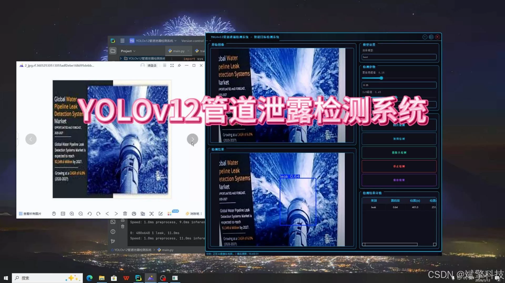
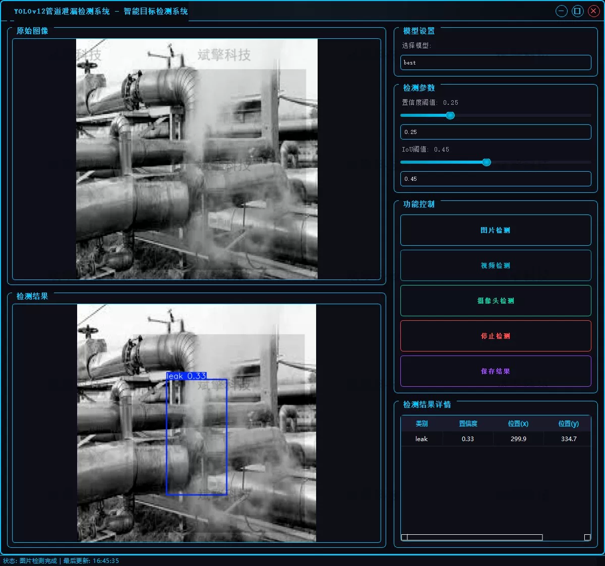
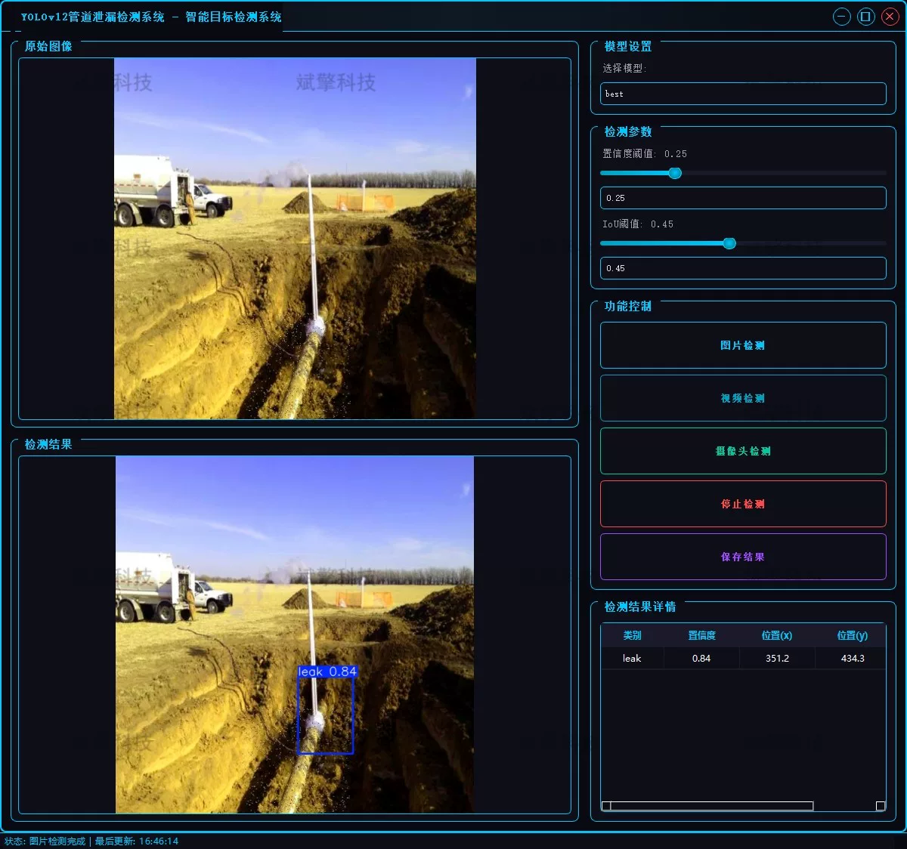
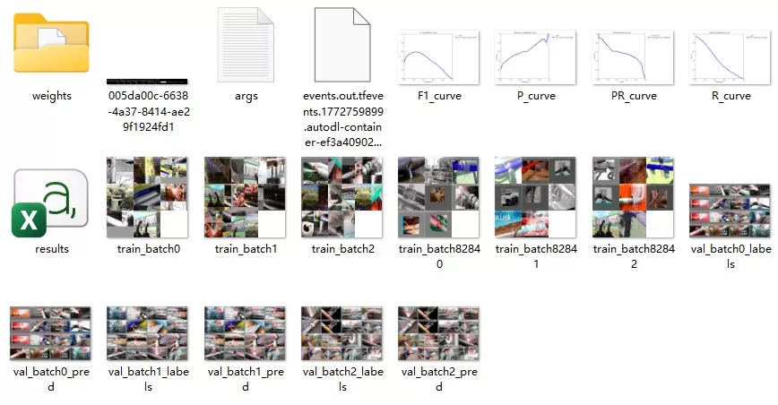
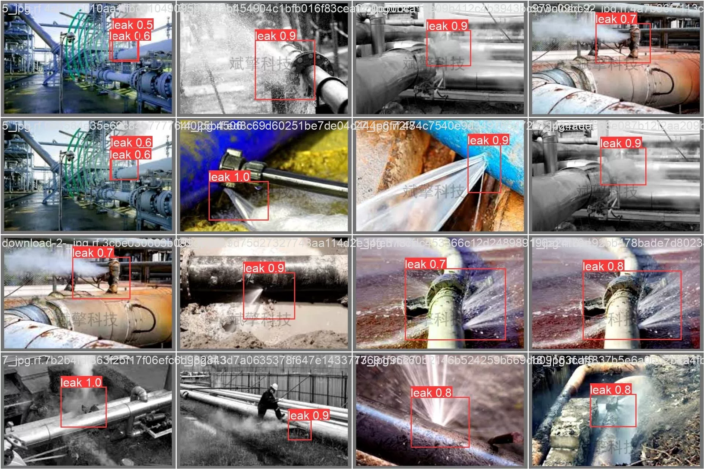

# YOLOv12 pipeline leak detection software

## Body

YOLOv12 Pipeline Leakage Detection Software Based on Deep Learning YOLOv12: A Pipeline Leakage Detection System (YOLOv12+YOLO dataset + UI interface + login and registration interfaces + Python project source code + model)

Pipeline leak detection is an important aspect of industrial safety production. Traditional manual inspection methods are inefficient, lack real-time performance, and are prone to missed detections. This project has developed a smart pipeline leak detection system based on the latest YOLOv12 object detection algorithm, achieving real-time and precise identification of pipeline leaks.
The system utilizes advanced deep learning technology to automatically detect and locate leak areas in pipeline images through training the YOLOv12 model. The project provides a complete visual interaction interface that supports image detection, video detection, and real-time camera detection, meeting the application needs in different scenarios. Users can quickly identify pipeline leak situations by uploading images, videos, or calling cameras, and the system will display the detection results intuitively.
This system features fast detection speed, high accuracy, and simple deployment, which can be widely applied in scenarios such as chemical plants, oil pipelines, water supply networks, etc., providing intelligent solutions for industrial safety production.

System Function Overview

✅ User login and registration: Supports password verification and security validation.

✅ Three detection modes: Based on the YOLOv12 model, support image, video, and real-time camera detection, accurately identifying targets.

✅ Dual-screen comparison: Display original images and detection results simultaneously on the screen.

✅ Data visualization: Real-time table displays the category, confidence, and coordinates of detected targets.

✅ Intelligent parameter adjustment: Offers a confidence slide bar to dynamically optimize detection accuracy, adapting to different scene requirements.

✅ Sci-fi style interactive interface: Dark theme combined with dynamic light effects, reducing visual fatigue and improving operational experience.

✅ Multi-thread high-performance architecture: Independent detection threads ensure smooth operation, real-time status prompts, and rapid response without lag.

Dataset Introduction

Training set: 3481 images.                                                                                                               
Validation set: 911 images.

## Images

## Payment

Here is a pay link on Stripe ( https://buy.stripe.com/3cs8yP7sY87d0vu9AB ). Please contact me lonlonago@foxmail.com after funding $89, and I will send you a complete data files , thank you!

